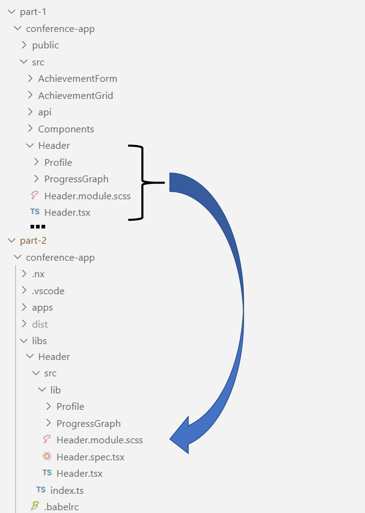
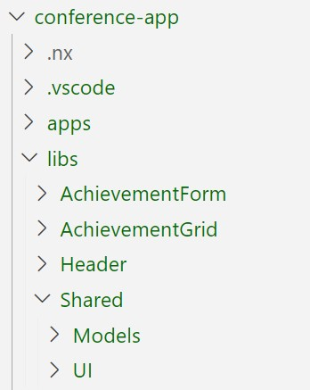
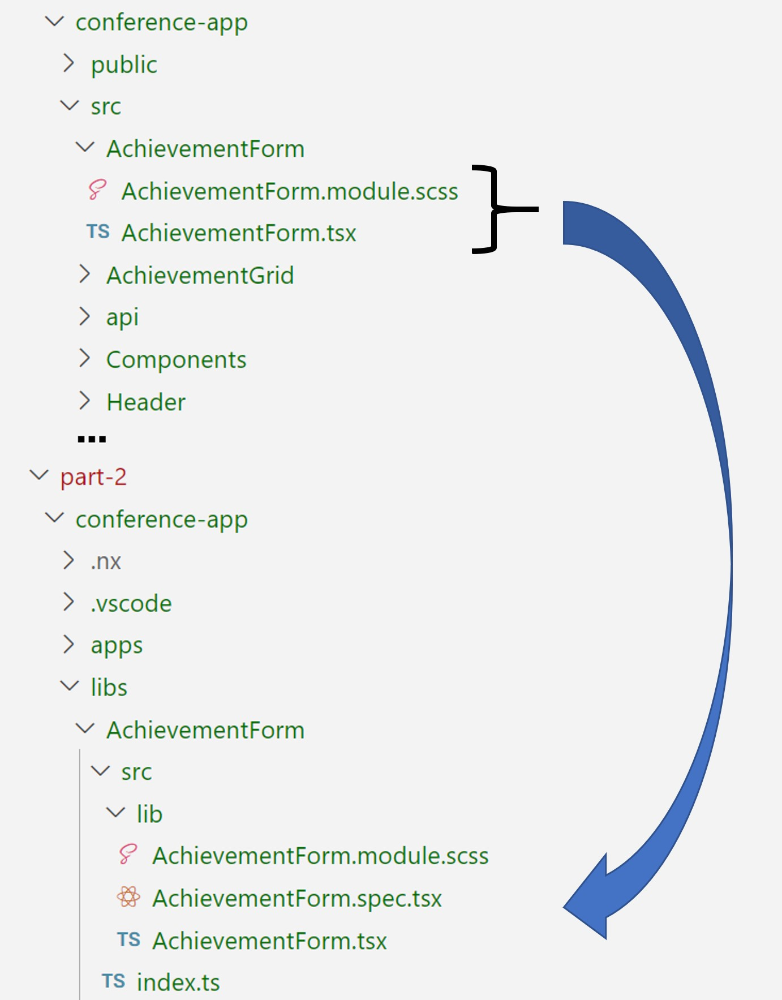

# Part 2 instructions

## Creating a monorepository

Lets turn our original conference application into a monorepository.

Open your terminal in the part 2 folder and enter the following command:

```
npx create-nx-workspace@latest conference-app --preset=react-monorepo
```

For the options select:

- name: conference-app
- bundler: vite
- E2E runner: none
- Stylesheet format: scss
- distributed caching: No -> paid service if you say yes.

This created a new folder called 'conference-app' that contains our monorepository. The command also runs `npm install` so this will take a minute.

## Serve the application

```
cd conference-app
npx nx serve conference-app
```

## Import dependencies

Our original conference application has some third-party dependencies. Let's add these to our monorepository.

```
npm install chart.js react-chartjs-2 classnames
```

## Create your first library

To get started let's try to integrate our `Header` into our monorepo. To do this, we first create a new library:

```
npx nx g @nx/react:lib Header --directory=libs/Header --unitTestRunner=vitest --bundler=vite --projectNameAndRootFormat=as-provided
```

This will create a new library called `Header` in the `libs` folder. This is where our header code will live.

Now that we have our library, its time to move some code. Copy the contents of the `Header` folder from the conference-app in part 1 to the lib folder of the new header library. For now, you can also copy the `models.ts` from the api folder into the headers library.



Make sure that all the imports in the header files are ok, and then your libary is finished.

## Using your library

Now that we have a library we can use it in our conference-app. Navigate to the conference-app in the app folder of the monorepo and open the `app.tsx` file. Here we are going to add our `Header`.

We can't import components from other libraries anymore by referring to them by their file path. We need to import them from their package.

First we have to import our `Header` component from the library. We can do this with the following import:

```ts
import { Header} from '@conference-app/Header';
```

All components that are exported in the `index.ts` file of the library can be imported this way.

Now we can add our `header` to the app with some dummy data:

```tsx
function App() {
  const user = {
    id: 1,
    name: 'John Doe',
    profileImage: 'https://picsum.photos/150/150'
  };

  const achievementSummary = {
    total: 5,
    completed: 3,
    uncompleted: 2
  };

  return (<Header user={user} achievementSummary={achievementSummary}/>);
}
```

If you now serve the app, you should be able to see the `Header` in the browser with the mock data.

## Continue.

Now that we have one library, we can create other components.

## Creating libraries

Looking at our folder structure, there are 4 obvious packages to create. `AchievementForm`, `AchievementGrid`, `Header` and `Components`. We've already created the `Header` library. Let's start creating the other libraries:

```
npx nx g @nx/react:lib AchievementForm --directory=libs/AchievementForm --unitTestRunner=vitest --bundler=vite --projectNameAndRootFormat=as-provided

npx nx g @nx/react:lib AchievementGrid --directory=libs/AchievementGrid --unitTestRunner=vitest --bundler=vite --projectNameAndRootFormat=as-provided
```

Since `Components` was meant as a folder where we will store some shared UI components, we'll move this to a shared folder.

```
npx nx g @nx/react:lib Shared-UI --directory=libs/Shared/UI --unitTestRunner=vitest --bundler=vite --projectNameAndRootFormat=as-provided
```

The last thing we have to do is create a library to share some models throughout our application. This library will contain our api models that are used in multiple libraries.

```
npx nx g @nx/react:lib Shared-Models --directory=libs/Shared/Models --unitTestRunner=vitest --bundler=vite --projectNameAndRootFormat=as-provided
```

Now we have created all 5 libraries we are going to need for our workshop. Our folder structure should look like this now:



## Moving code

Now that we have created our libraries, we can move our code over to the monorepository.

Copy the contents of the `AchievementForm` and `AchievementGrid` folders in the original application to the `lib` folder of their respective libraries.



For our Shared-UI libary, a little more work is needed. Move the files in the `Components` folder to the lib folder of Shared-UI.

After this we need to make sure the components are exported. Change the `index.ts` file to export the right components to the rest of the monorepository.

```typescript
export * from './lib/Modal';
export * from './lib/StyledContainer';
```

The last code we need to move is our api calls and models. The models need to be moved to the Shared-Models library. You can override the contents of the `Shared-Models.tsx` file with the contents of the `models.ts` file from the original application.

Export your models via the `index.ts` file to expose them to the rest of the monorepository:

```typescript
export * from './lib/models';
```

Lastly we are going to move the `submitAchievement.ts` to the `AchievementForm` library, the `submitIncrementAchievement.ts` to the `AchievementGrid` library and the `useFetchAppData.ts` will be moved to the conference application folder.

## Fixing imports

Now that our code is moved we still have a lot of errors in our application. This is because our imports are broken and we need to resolve our dependencies that have changed. Fix the imports in the code we copied.

## Bringing it all together

Now that our libraries are ok, we are going to bring it all together in the app.

Copy the `app.tsx` and `app.modules.scss` files from the original application to the conference-app folder. Once you fix the imports for this file, you can serve the application using `npx nx serve conference-app`.